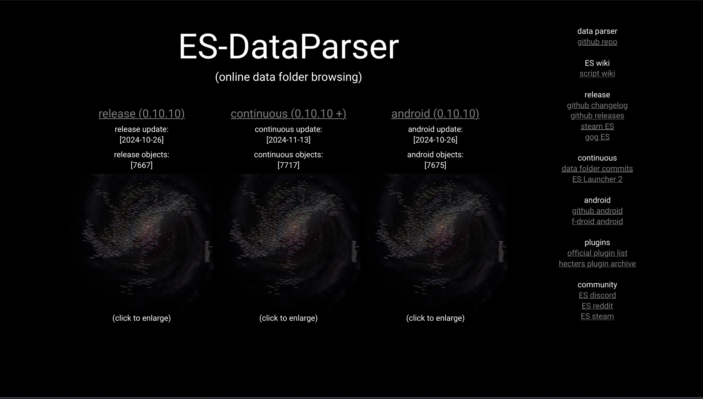
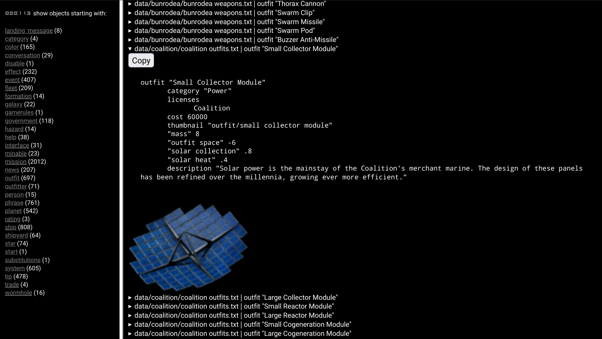

# ES-DataParser
 
This repository
<ul>
<li>checks hourly for updates in ES release / ES continuous / ES Android</li>
<li>downloads the data folder if an update is there</li>
<li>converts the data to a basic webpage showing all game object</li>
<li>converts the data to a star map image</li>
</ul>
 
 
<a href='https://zuckung.github.io/ES-DataParser/'>https://zuckung.github.io/ES-DataParser/</a> 
 
For an easier browsing and comparing of game objects, like missions, ships, systems, and others.  
     

